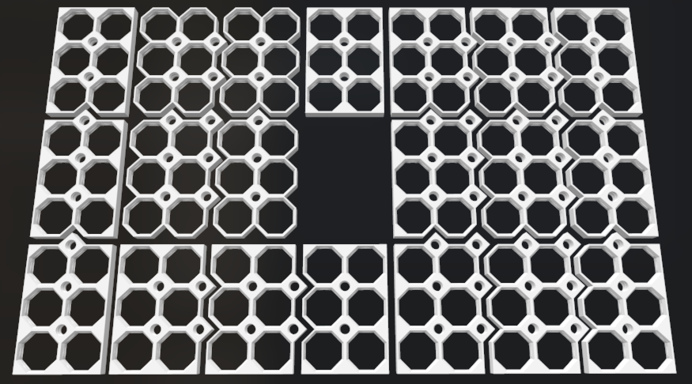

# Parametric multiboard stacks

## Info & credits

Refer for more info:
[multiboard.io](https://www.multiboard.io/)

Or at thangs.com
[8x8 Multiboard Code Tile](https://thangs.com/designer/Keep%20Making/3d-model/8x8%20Multiboard%20Core%20Tile-974214)

Thanks to [shaggyone](https://github.com/shaggyone) for doing the hard work!
Forked from [multiboard-parametric](https://github.com/shaggyone/multiboard-parametric)

## Usage

``` C
// Create a common (core) tile 3 cells width, and 2 cells in height
classic_core(3, 2);

// Create a side tile tile 3 cells width, and 2 cells in height. Tooth are on
// the right side
classic_side(3, 2);

// Create a side tile tile 3 cells width, and 2 cells in height. Tooth are on
// the top side
classic_side2(3, 2); // keeps x&y consistant with other generated tiles
// or
classic_side(2, 3);

// Create a corner 3 by 2 tile
classic_corner(3, 2);

// see the end of the code for all examples
```

If you use it, please let us know.

## Examples

### All tiles at once

Setting ```grid_type="test";``` in the code will generate all the possible tiles as shown in this image.



### classic tiles

Left of center in the above image

| first column | middle columns | last column |
| :--: | :--: | :----: |
| ```grid_type="side";``` | ```grid_type="side";``` | ```grid_type="corner";``` |
| ```grid_type="core";``` | ```grid_type="core";``` | ```grid_type="side2";``` |
| ```grid_type="core";``` | ```grid_type="core";``` | ```grid_type="side2";``` |

### flat sided tiles

The nine tiles on the right side of the above image

| first column | middle columns | last column |
| :--: | :--: | :--: |
| ```grid_type="top left";``` | ```grid_type="top";``` | ```grid_type="top right ";```|
| ```grid_type="left";``` | ```grid_type="core";``` | ```grid_type="right";``` |
| ```grid_type="bottom left";``` | ```grid_type=""bottom;``` | ```grid_type="bottom right";``` |

### single tile with four flat sides

In the middle of the above image

| only cell |
| :--: |
| ```grid_type="single";```  |
|The STL included in this repo is an example of stacking.  It's only valuable as an example since every tile is a flat side.  Who would want 12 tiles that cannot be joined together.|

### Horizontal flat tiles

Along the bottom of the above image

| first column | middle columns | last column |
| :--: | :--: | :--: |
| ```grid_type="left end";``` | ```grid_type="horizontal";``` | ```grid_type="right end";``` |

### Vertical flat tiles

Down the left side of the above image

| Only column |
| :--: |
| ```grid_type="top end"```; |
| ```grid_type="vert";``` |
| ```grid_type="bottom end"```; |